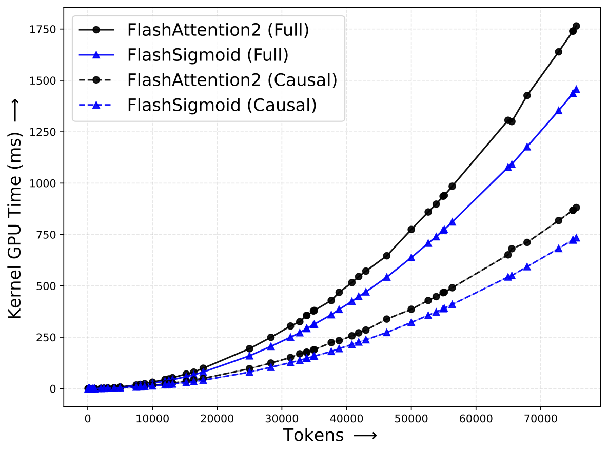
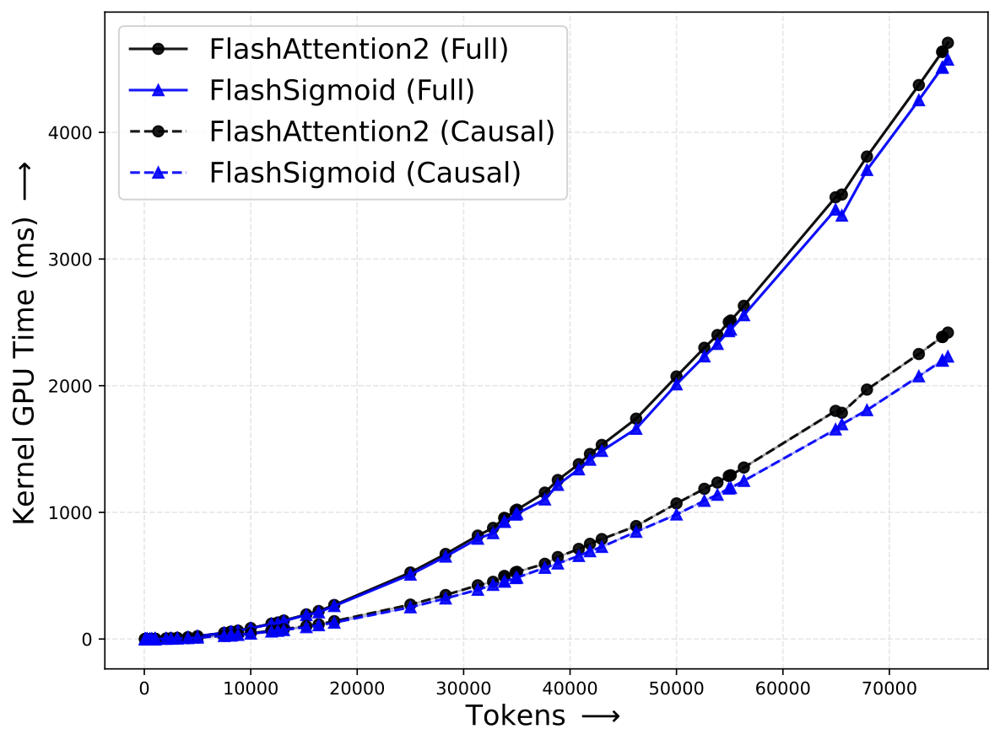

# Sigmoid Attention

This repo contains the code associated with [Theory, Analysis, and Best Practices for
Sigmoid Self-Attention](#sigmoid-attention) [Link Incoming]

## Components

The three components of this release are:

  - [FlashSigmoid](./flash_sigmoid): A hardware aware implementation of Sigmoid Attention.
  - [Optorch](./optorch): PyTorch-based functional implementation of standard optimizers.
  - [Attention Simulator](./attention_simulator): A research friendly codebase for diagnosing and debugging attention.

## Installation

See the `README.md` in the corresponding component for installation and usage instructions.  

We provide a convenience installation helper for all three packages:
```bash
# Create an environment for sigmoid attention, if not done already.
conda create -n sigmoid-attn-py310 python=3.10
conda activate sigmoid-attn-py310

# Setup Flashsigmoid -> Optorch -> Attention Simulator.
bash setup.bash
```

## Performance

|                                      Forward pass kernels on H100.                                       |                                Backward pass kernels on H100.                                |
|:--------------------------------------------------------------------------------------------------------:|:--------------------------------------------------------------------------------------------:|
|  |  |


|                   Train losses comparing SigmoidAttn with SoftmaxAttn.                   |
|:----------------------------------------------------------------------------------------:|
|  |


## Citation
If you find this work useful in your research, please cite:
```
[Link Incoming]
```
